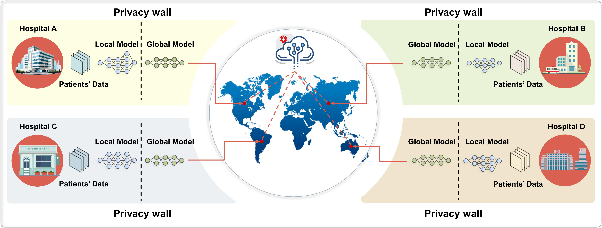

# DynamicFL
Towards Fairness-aware and Privacy-preserving Enhanced Collaborative Learning for Healthcare



## Usage

Here is an example for PyTorch: 
```
python main.py --node_num 10 --dataset cifar10 --R 100 --batchsize 64
```
